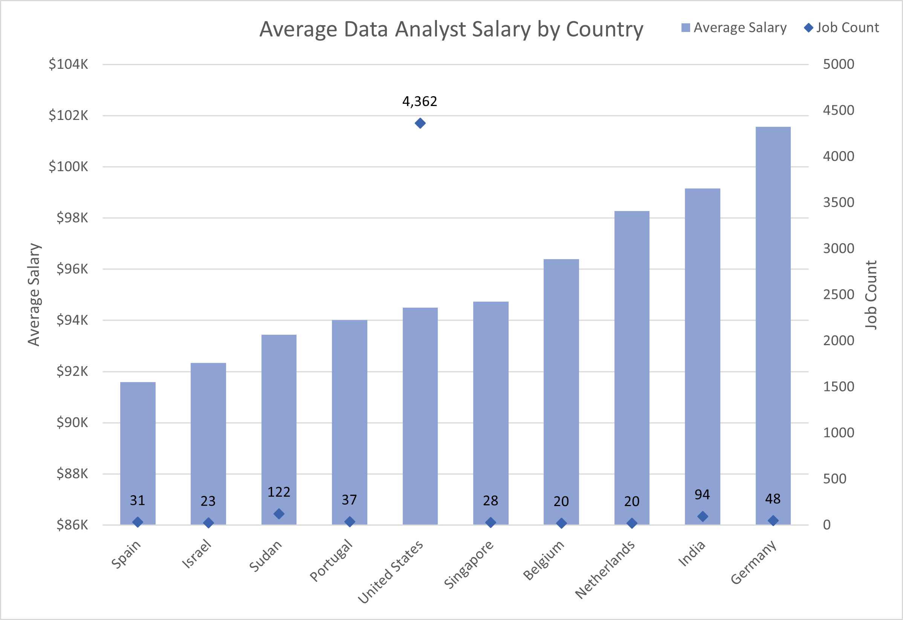
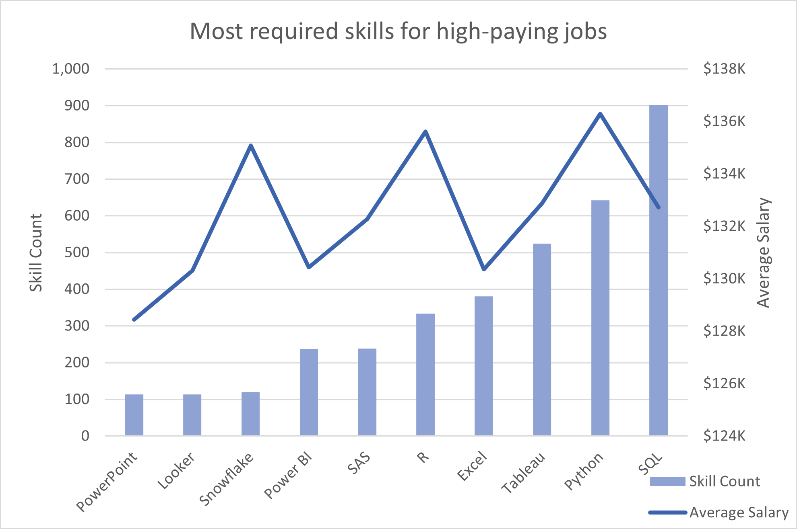
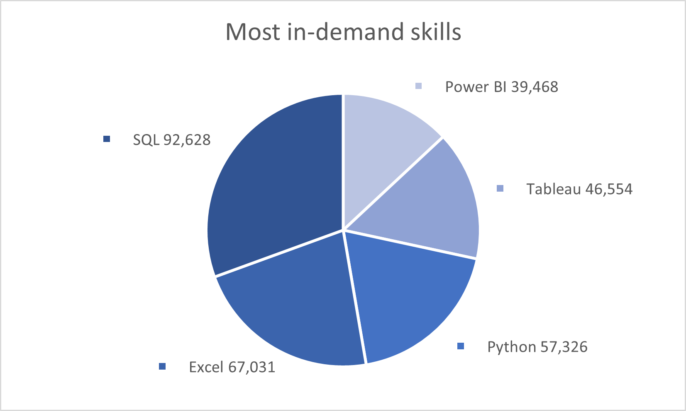

# 📊 Data Analyst Job Market SQL Analysis

## 📌 Introduction

I started this project to build up my SQL portfolio and get some real hands-on experience.  
Instead of just following tutorials, I wanted to explore something practical and relevant — so I chose to dive into the data analyst job market.

This project looks into:
- Top-paying jobs 💰
- The most common and high-paying skills 🔧
- What’s really worth learning to land better roles 📈

🔍 SQL Queries: [project_sql_for_sharing](/project_sql_for_sharing/)  
📁 Dataset: [Google Drive - CSV Files](https://drive.google.com/file/d/15gLH5R3ZN4HE7mxNLHvGt7Wk_kqYp_Xc/view?usp=sharing)

---

## 🔎 Background

This project is about answering real questions that I had as a student preparing for a career in data analytics:

> *What skills should I focus on learning? What jobs actually pay well? What tools do companies want in a data analyst?*

So I used SQL to break down job posting data and answer those questions with actual evidence.

---

## ❓ Key Questions I Wanted to Answer

1. What are the **top-paying** data analyst jobs?
2. What **skills** are required for those high-paying jobs?
3. What are the **most in-demand** skills for data analysts?
4. Which skills are associated with **higher salaries**?
5. What are the **most optimal skills** to learn?

---

## 🛠️ Tools I Used

- **SQL** – to query and explore the job data  
- **PostgreSQL** – for handling and storing the database  
- **VS Code** – for writing and testing SQL scripts  
- **Git & GitHub** – for version control and sharing my work  

---

## 📊 The Analysis

### 1. Top-Paying Jobs
```sql
SELECT  
    job_id,
    job_title,
    job_location,
    job_country,
    job_schedule_type,
    salary_year_avg,
    job_posted_date,
    name as company_name
FROM 
    job_postings_fact 
LEFT JOIN company_dim ON job_postings_fact.company_id = company_dim.company_id
WHERE
    job_title_short = 'Data Analyst' AND
    salary_year_avg IS NOT NULL
ORDER BY
    salary_year_avg DESC
```


*The bar chart shows the "Average Data Analyst Salary by Country", including only countries with at least 20 job postings, which I filtered using Power Query to avoid outliers and ensure the data is more reliable. From the chart, we can see that Germany offers the highest average salaries for data analyst roles. The United States, while not the top in salary, has the largest number of job postings, suggesting more opportunities in the field. This could be due to the dataset having a higher volume of listings from the U.S., which may affect overall representation.*

By running the SQL query, I found that many of the **top-paying roles** are not entry-level, but rather **senior or management-level positions**. These jobs typically require more experience, leadership skills, and often involve working in specialized domains such as healthcare or infrastructure.

### 💼 Examples of high-paying roles:
- `Head of Data Analytics`
- `Director of Analytics`
- `Sr Data Analyst`
- `HC Data Analyst, Senior`

📌 **Insight**: To reach higher salary levels as a data analyst, it’s important to:
- Gain more experience
- Take on leadership or strategic responsibilities
- Develop domain expertise in specific industries (e.g., healthcare, infrastructure)


### 2. Skills Required for Top-Paying Jobs
```sql
WITH top_paying_jobs AS (

    SELECT  
        job_id,
        job_title,
        salary_year_avg,
        name as company_name
    FROM 
        job_postings_fact 
    LEFT JOIN company_dim ON job_postings_fact.company_id = company_dim.company_id
    WHERE
        job_title_short = 'Data Analyst' AND
        salary_year_avg IS NOT NULL
    ORDER BY
        salary_year_avg DESC
    LIMIT 10
)

SELECT 
    top_paying_jobs.*,
    skills
FROM top_paying_jobs
INNER JOIN skills_job_dim ON top_paying_jobs.job_id = skills_job_dim.job_id
INNER JOIN skills_dim ON skills_job_dim.skill_id = skills_dim.skill_id
ORDER BY 
    salary_year_avg DESC
```
## 💼 Skills in Top-Paying Data Analyst Roles

Using SQL, I analyzed the top 10 highest-paying `Data Analyst` jobs and extracted their required skills.

### 🔍 Key Takeaways
- Most top-paying roles are **senior or leadership positions**.
- Strong mix of **programming, analytics, and visualization tools** is expected.
- Domain-specific or enterprise tools are common in specialized roles.

### 🛠️ Common Skills

**Languages & Tools**
- `Python`, `R`, `SQL`, `SAS`, `Matlab`

**BI & Visualization**
- `Tableau`, `Power BI`, `Excel`, `Looker`

**Cloud & Pipelines**
- `Snowflake`, `BigQuery`, `Airflow`, `Spark`, `Kafka`

**Others**
- `Git`, `Linux`, `Oracle`, `Word`

📌 To reach these roles, focus on building **technical depth**, **communication skills**, and **domain expertise**.



*To evaluate which skills are most relevant in high-paying data analyst roles, I first filtered the dataset to include only jobs with salaries **above the upper quartile (Q3)**. The Q3 salary threshold was calculated using **SQL** (see comments in [`2_top_paying_jobs_skill.sql`](project_sql_for_sharing/2_top_paying_jobs_skill.sql)), and the filtering was done using **Power Query** to exclude lower-paying roles.*

*In Power Query, I also used a conditional column to standardize skill names — for example, converting `sql` to `SQL` and `sas` to `Sas`. For skills that only needed the first letter capitalized, I applied the transformation via `Transform` → `Text Column` → `Format` → `Capitalize Each Word` to keep the skill names consistent and clean.*

📌 I then visualized the **average salary associated with each skill** across high-paying data analyst roles. The chart highlights that some skills consistently appear in top-paying jobs and are associated with higher average salaries.

### 💡 Top High-Paying Skills
These skills stood out for their strong link to higher salaries:
- `Python`
- `R`
- `Snowflake`

These tools are not only frequently listed in high-paying job postings, but also tend to offer a **higher average salary**, making them especially valuable for data analysts looking to advance their careers.


### 3. Most In-Demand Skills
```sql
SELECT skills, COUNT(*) AS demand_count
FROM job_postings_fact
JOIN skills_job_dim USING (job_id)
JOIN skills_dim USING (skill_id)
WHERE job_title_short = 'Data Analyst'
GROUP BY skills
ORDER BY demand_count DESC
LIMIT 5;
```

### 🔍 Analysis: Most In-Demand Skills for Data Analysts (Beginner-Friendly Version)

This query is a simplified (or downgraded) version of the earlier analysis on top-paying jobs. It focuses on the **most frequently requested skills** for **all Data Analyst positions**, regardless of salary level. This makes it a great starting point for beginners who want to quickly understand what the market demands.

- **SQL** tops the list with 92,628 job postings, confirming it as an essential skill for querying and managing data.
- **Excel** remains highly important with 67,031 postings, reflecting its continued use for data organization and analysis.
- **Python** is the third most requested skill (57,326 postings), showing its rising popularity for data tasks beyond spreadsheets.
- Visualization tools like **Tableau** and **Power BI** also feature strongly, appearing in thousands of job ads, highlighting the need to communicate insights visually.

---

### 💡 Insight Summary

- This beginner-friendly view shows the foundational skills every aspiring data analyst should prioritize.
- Mastering **SQL**, **Excel**, and basic **Python** can open many job opportunities.
- Learning visualization tools such as Tableau and Power BI will further enhance your employability and ability to deliver insights.


### 4. Skills with Highest Salaries
```sql
SELECT 
    skills,
    ROUND(AVG(salary_year_avg),2) AS avg_salary
FROM job_postings_fact
INNER JOIN skills_job_dim ON job_postings_fact.job_id = skills_job_dim.job_id
INNER JOIN skills_dim ON skills_job_dim.skill_id = skills_dim.skill_id
WHERE
    job_title_short = 'Data Analyst' AND
    salary_year_avg IS NOT NULL
GROUP BY
    skills
ORDER BY
    avg_salary DESC
LIMIT 25;
```

### 💼 Top 10 Skills by Average Salary

| Skill       | Average Salary |
|-------------|---------------:|
| Svn         | $400,000       |
| Solidity    | $179,000       |
| Couchbase   | $160,515       |
| Datarobot   | $155,486       |
| Golang      | $155,000       |
| Mxnet       | $149,000       |
| Dplyr       | $147,633       |
| Vmware      | $147,500       |
| Terraform   | $146,734       |
| Twilio      | $138,500       |
> _Note: These salaries are based on job postings that listed average salary. Some results may be skewed by niche or senior-level roles._


### Top Skills by Average Salary for Data Analysts

This analysis shows which skills are linked to higher average salaries in data analyst roles. Some skills like **SVN**, **Solidity**, and **Golang** appear at the top, but they might come from a few senior or niche job postings.

More commonly, we see high-paying roles asking for skills in **machine learning** (like **Keras**, **PyTorch**, **TensorFlow**) and **cloud or workflow tools** (like **Airflow**, **Terraform**, **Ansible**). These tools are usually used in more advanced or technical roles.

It suggests that picking up some of these skills — especially those related to **ML** or **cloud infrastructure** — can be useful if you want to grow beyond entry-level and aim for higher-paying positions in the future.


### 5. Most Optimal Skills (High Salary + High Demand)
```sql
SELECT skills, COUNT(*) AS demand_count, ROUND(AVG(salary_year_avg), 0) AS avg_salary
FROM job_postings_fact
JOIN skills_job_dim USING (job_id)
JOIN skills_dim USING (skill_id)
WHERE job_title_short = 'Data Analyst'
  AND salary_year_avg IS NOT NULL
  AND job_work_from_home = TRUE
GROUP BY skills
HAVING COUNT(*) > 10
ORDER BY avg_salary DESC
LIMIT 10;
```

---

## 📘 What I Learned

- How to build SQL queries to answer business questions
- How to use `JOIN`, `GROUP BY`, `CTE`, and `HAVING` clauses effectively
- How to combine different metrics (salary + demand) for better insights
- How to clean and analyze structured job data

---

## ✅ Conclusion

- **SQL** is the most important skill — both high paying and high demand
- **Python, Excel, Tableau** are essential to most data analyst jobs
- Learning **cloud tools** (like Snowflake, BigQuery, AWS) can increase salary potential
- Focus on skills that are **both demanded and well-paid** for best ROI

---

## 📁 Resources

- 📂 SQL Scripts: [`project_sql_for_sharing`](/project_sql_for_sharing/)  
- 📊 Dataset: [CSV on Google Drive](https://drive.google.com/file/d/15gLH5R3ZN4HE7mxNLHvGt7Wk_kqYp_Xc/view?usp=sharing)

---

## 📈 Visuals Coming Soon

- Top 10 job salaries (bar chart)  
- Most required skills for high-paying jobs  
- Most in-demand skills  
- Highest salary by skill  
- Optimal skills (salary vs demand scatter plot)  

